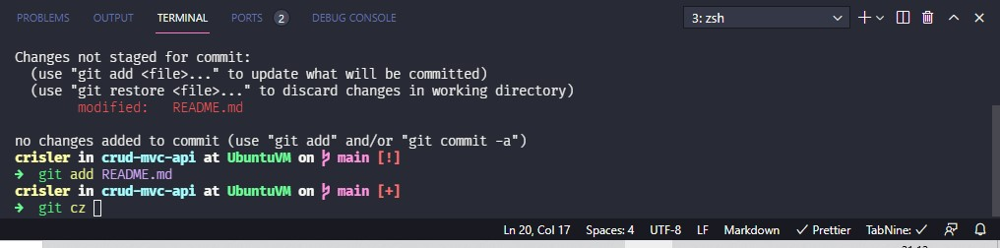
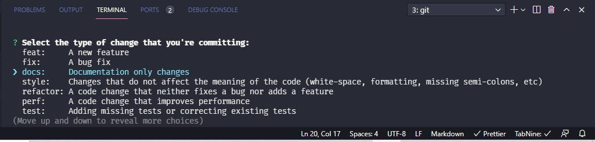
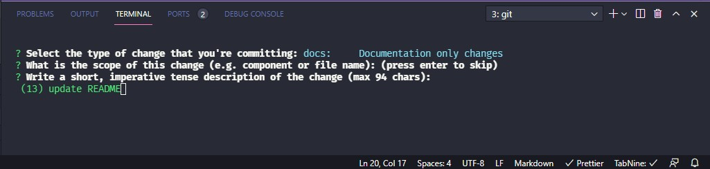

# CRUD (Create, Read, Update & Delete) API with NestJS and Docker

## Sobre o Projeto

Esta aplicação utiliza o framework NodeJS MVC(Model,View & Controller) **NestJS**, escrevendo em
tabelas no banco de dados **PostgreSQL**, aplicando boas práticas de desenvolvimento utilizando commits semânticos para melhor compreensão do código desenvolvido.

## Arquitetura

Em microsserviços utilizando o **Docker** como container runtime, tanto para a aplicação quanto
para o banco de dados, porém irá salvar os dados em HD para não crescer o container.

## Dependencias

- @nestjs/config
- pg
- typeorm
- @nestjs/typeorm

## Boas práticas

Utilizo em meus projetos o commitlint instalado globalmente para reforçar os padrões de commits
para que crie a documentação do software em todas as etapas do desenvolvimento, neste projeto está configurado em commitlint.config.js a importação do módulo que foi instalado globalmente. Também estou utilizando o lint-staged e o husky para reforçar os commits por ordem de alteração, e irei configura-lo para rodar testes antes de autorizar os commits.
Adicionei o commitzen que é uma ferramenta incrível para escrever os commits da maneira correta.




## Tecnologias

- Node.js
- Typescript
- PostgreSQL
- Docker

## Execução

Necessita ter o Docker e Docker-Compose instalados

```
git clone https://github.com/crislerwin/crud-mvc-api.git
sudo docker-compose up --build
```

O PG-Admin está rodando na porta 9000 e a aplicação na porta 3000
